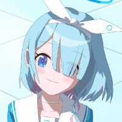
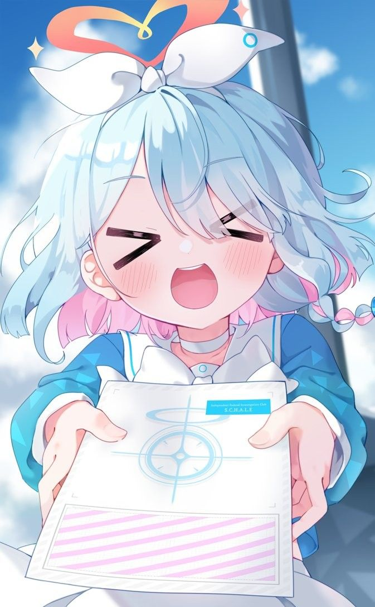
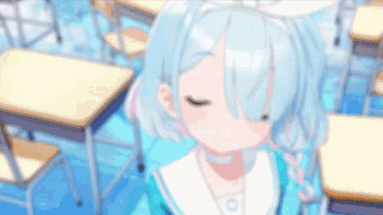

#

 
<!--  -->
 
 

-  Student from Vietnam 🇻🇳  
- 🎮 I enjoy playing Open-world, FPS Games, Adventure, Platformer, Rhythm *and some lewd visual novels (shhh, don’t tell anyone!)*     
  ↳ **Some games:**  [Muse Dash](https://store.steampowered.com/app/774171/Muse_Dash/),  [Osu!](https://osu.ppy.sh/),  [HI3rd](https://honkaiimpact3.hoyoverse.com/asia/vi-vn/home),  [Honkai: Star Rail](https://hsr.hoyoverse.com/vi-vn/home),...

- I’m quite skilled with  JavaScript,  [NodeJS](https://nodejs.org/) and  TypeScript  
- I can read and understand some code written in  [Python](https://www.python.org/) and  C++  
- I’m currently learning  [Go](https://go.dev/),  [Rust](https://rust-lang.org/) and  C#

 

 
 

- 📘 [***linhisreal/ProjectOne***](https://github.com/linhisreal/ProjectOne)  
  A cool project that does …  
- 📗 [***linhisreal/ProjectTwo***](https://github.com/linhisreal/ProjectTwo)  
  Another project that focuses on …

 

 

 *“Sensei, let’s conquer Kivotos together.” – Arona* 

## Discord

## My stats:

  

## Commits

  

## Thanks for reading ❤️
