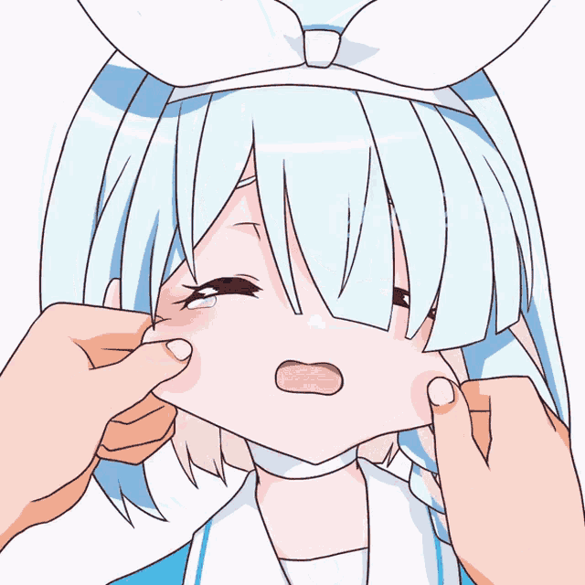

# Hi there, I'm Linh! 

 

-  Student from Vietnam 🇻🇳  
- 🮠I enjoy playing Open-world, FPS Games, Adventure, Platformer, Rhythm *and some lewd visual novels (shhh, don’t tell anyone!)*     
  ↳ **Some games:**  [Muse Dash](https://store.steampowered.com/app/774171/Muse_Dash/),  [Osu!](https://osu.ppy.sh/),  [Stella-Sora](images/stella_sora.png),  [Blue Archive](images/ba.png),...

- I’m quite skilled with  JavaScript,  [NodeJS](https://nodejs.org/) and  TypeScript  
- I can read and understand some code written in  [Python](https://www.python.org/) and  C++  
- I’m currently learning  [Go](https://go.dev/),  [Rust](https://rust-lang.org/) and  C#

 

- 📘 [***linhisreal/line***](https://github.com/linhisreal/line)  
  A passionate package manager for nodejs :D (private for now)
- 📗 [***linhisreal/actoper***](https://github.com/linhisreal/actoper)  
  A 3D engine powered by OpenGL and C++ :D (private for now)

 

 

 *“Sensei, let’s conquer Kivotos together.†– Arona* 

## Discord

## My stats:

  

## Commits

  

## Thanks for reading ❤️

